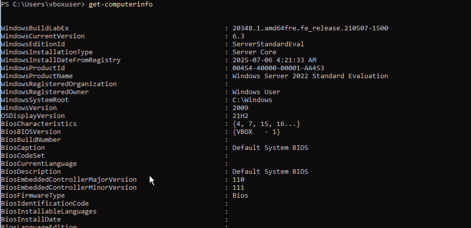
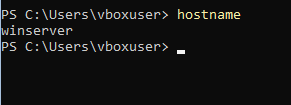
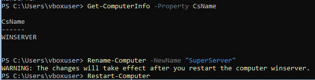
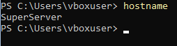

### Get-ComputerInfo 
Remark: Windows version is 2009 but product name is Windows Server 2022. As it turns out, 2009 is an internal code name and not an actual product name.

### hostname

### Rename-Computer

### new hostname

### Get-NetAdapter

### Get-TimeZone / Get-Help

