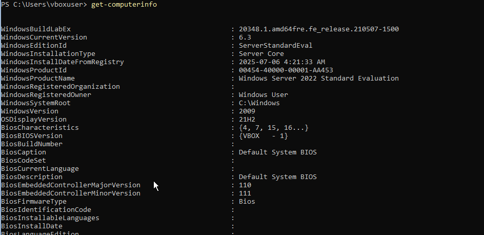
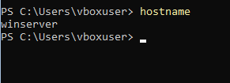
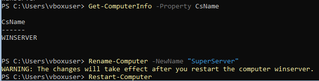
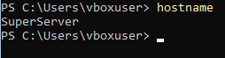
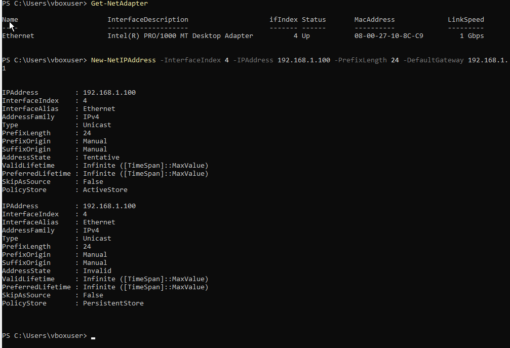
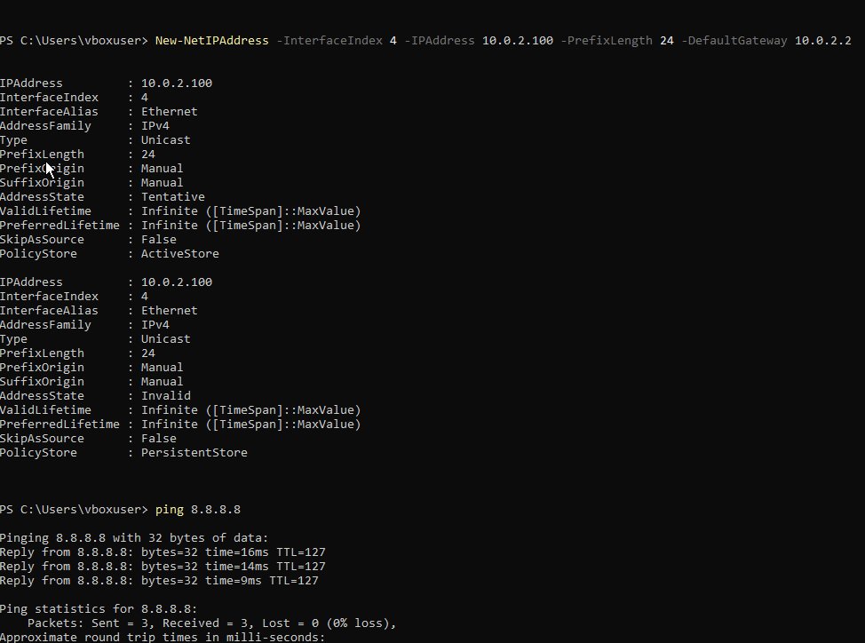
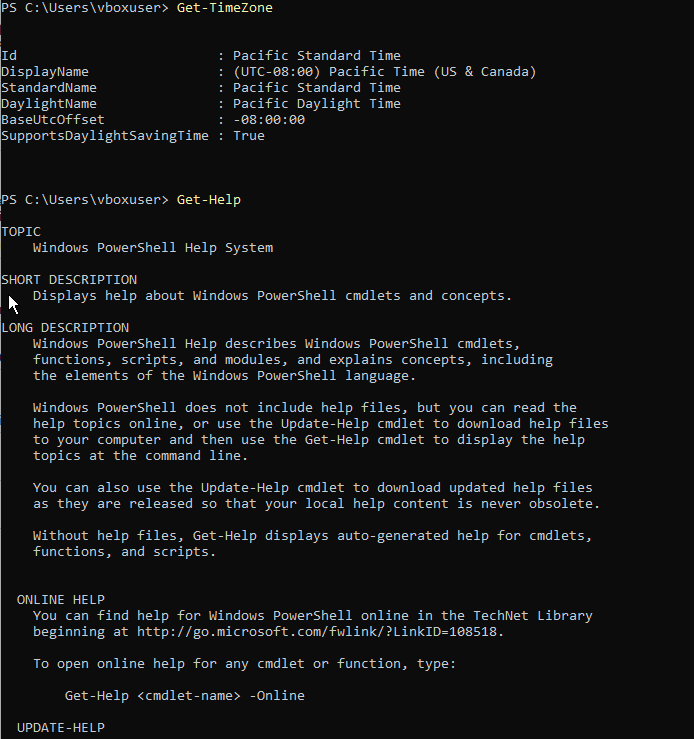

### Get-ComputerInfo 
Remark: Windows version 2009 but product name Windows Server 2022. 2009 is an internal code name and not an actual product name.

### hostname

### Rename-Computer

### new hostname

### Get-NetAdapter

Remark: The lab called for setting the IP to 192.168.1.100, but with that static IP, the VM could not reach the internet. VirtualBox's default NAT network uses the 10.0.2.x range, so a static IP within that range was used instead.

### Get-TimeZone / Get-Help

