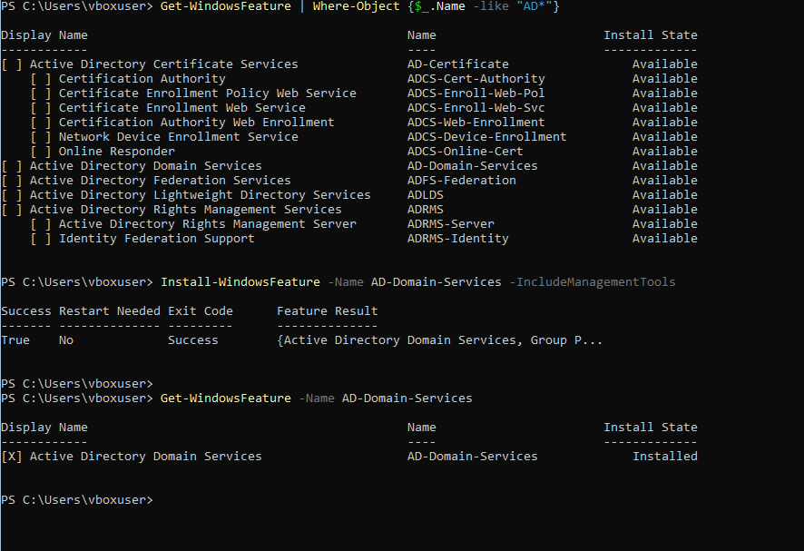
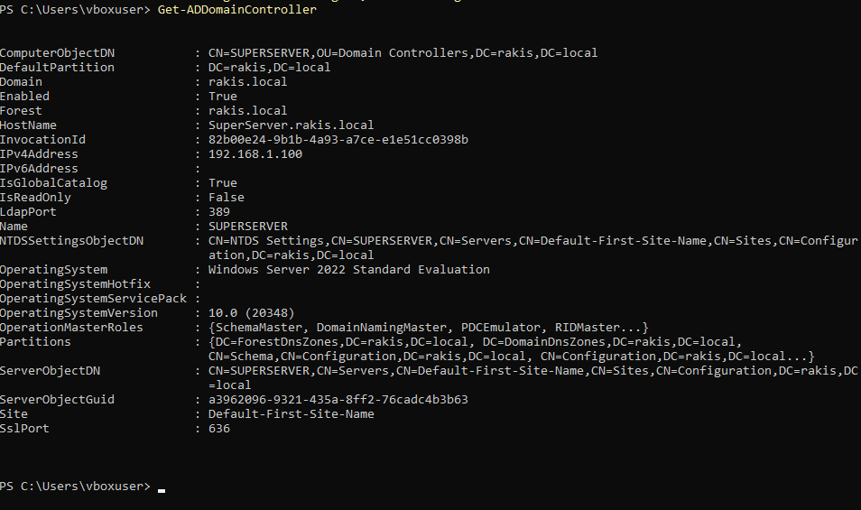
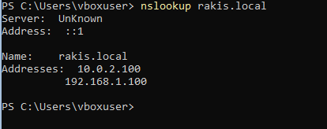
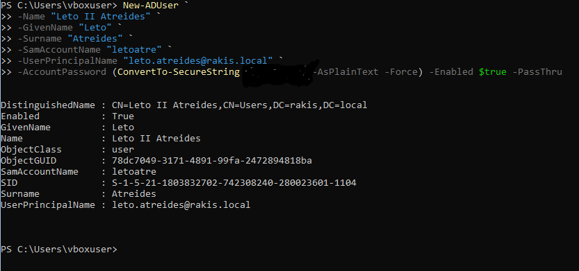
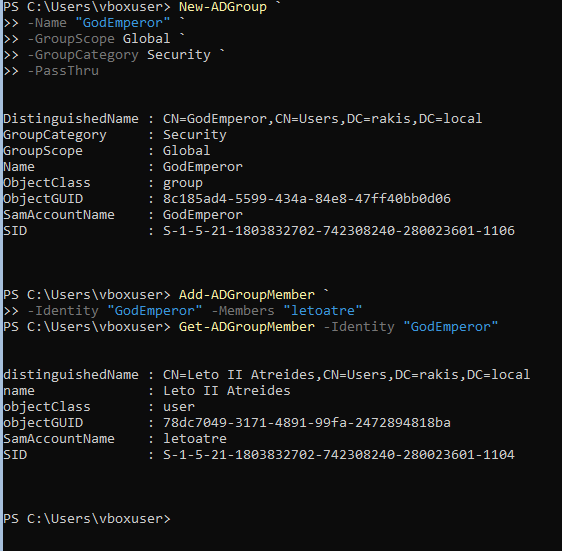

### Install Active Directory Domain Services Role

### Verify Active Directory Installation

### Verify DNS is operational

### Create a User Account

### Create a Security Group and Add the User

### Client Computer on Domain
 