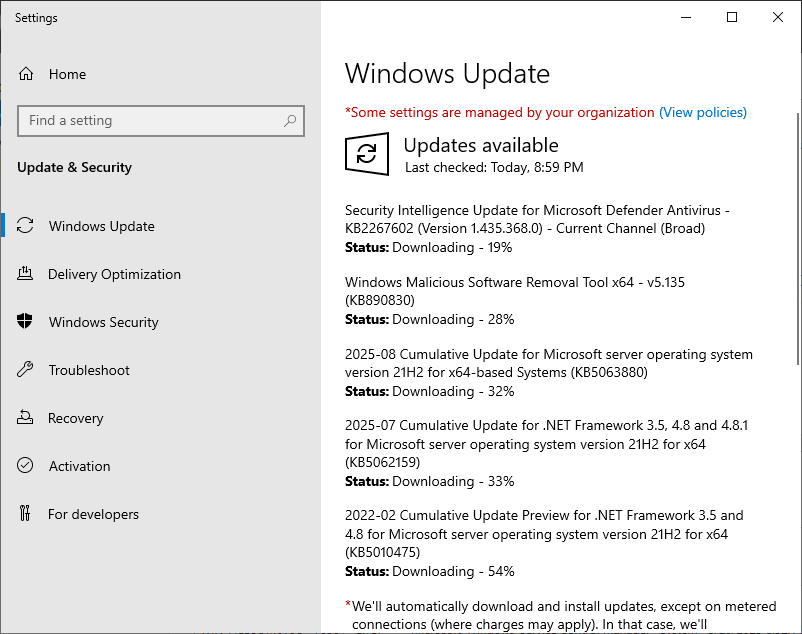
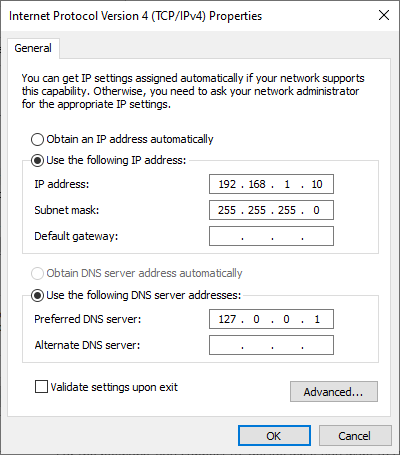
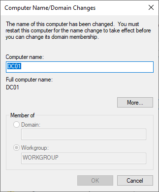
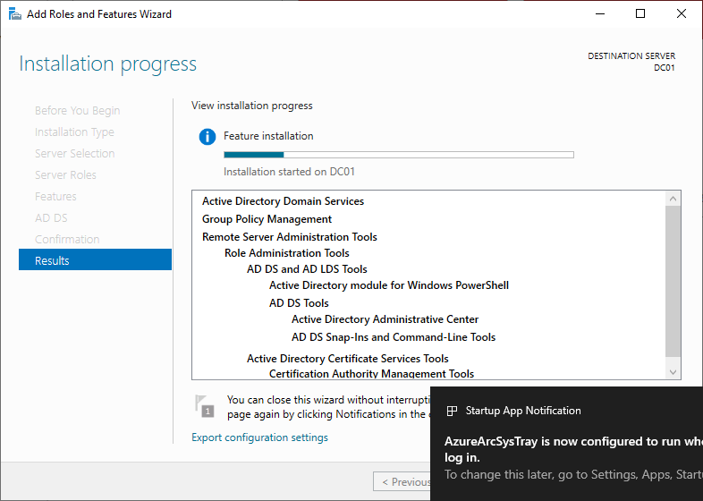
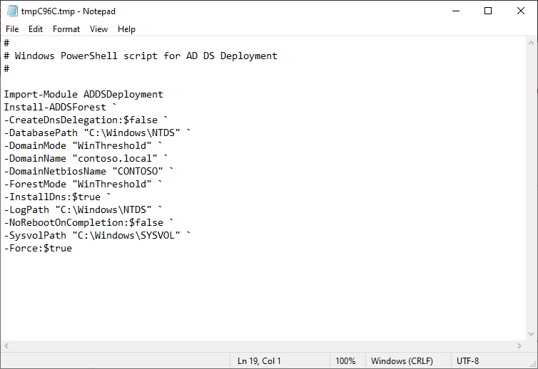
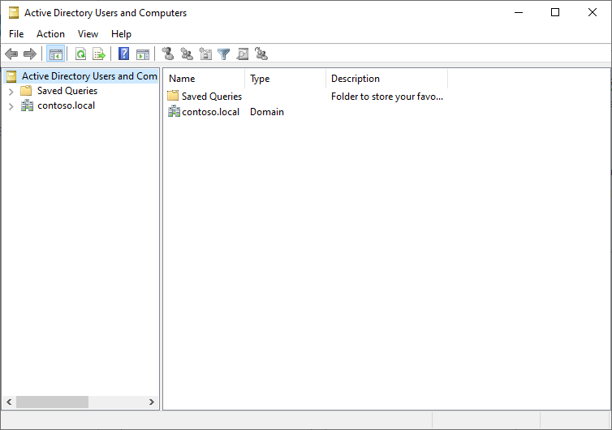

### 1. Updating

### 2. Set IP Address

### 3. Changing Computer Name

### 4. Installing Active Directory Domain Services Role

Why it matters: Promoting to DC establishes the forest root, which is the foundation for all AD objects.

### 5. Powershell Script For AD DS Deployment

This is how the same steps can be performed is a PowerShell command instead of the GUI.

### 6. Active Directory Users and Computers

